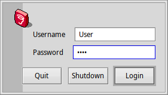
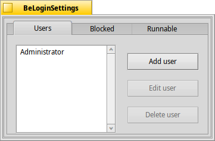
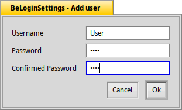

BeLogin
=======

A simple authorization mechanism for BeOS.

Originally from: http://sourceforge.net/projects/belogin/  
License: GNU GPL

## Screenshots
### BeLogin

### BeLoginSettings

### Add user

